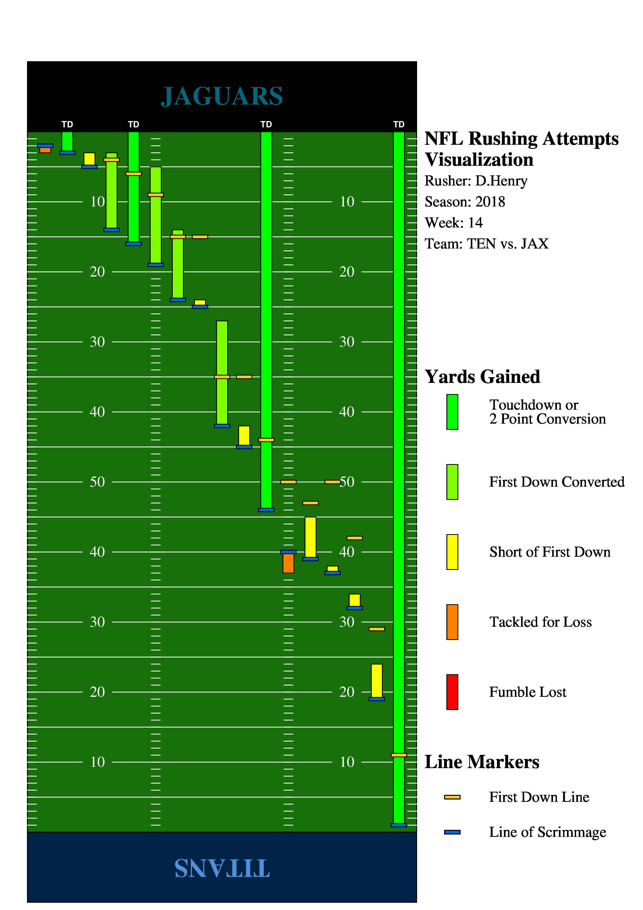
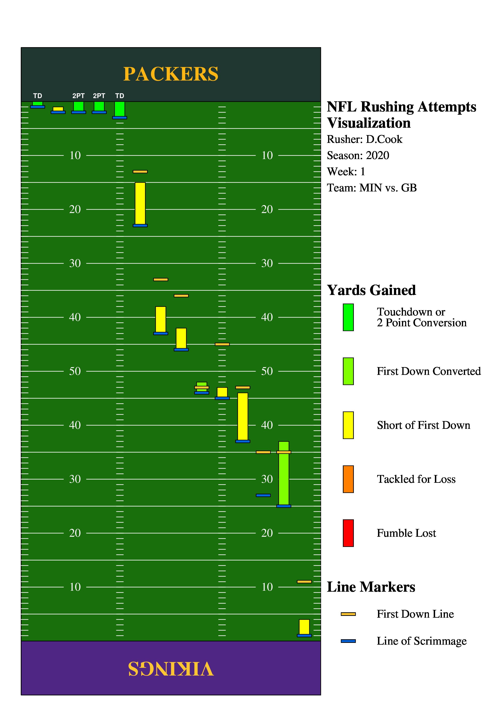
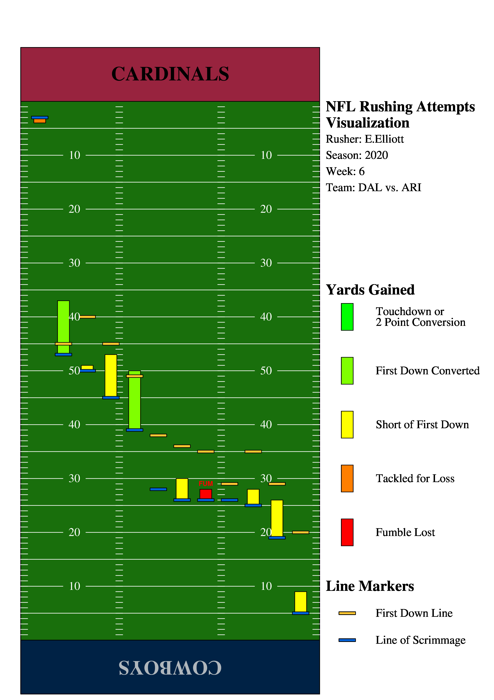
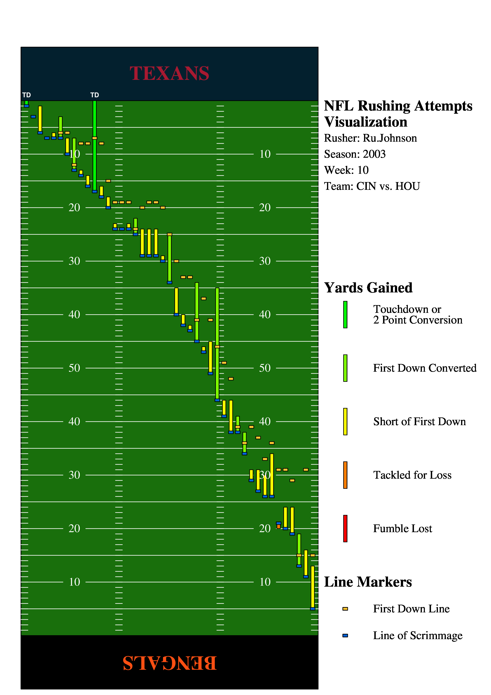
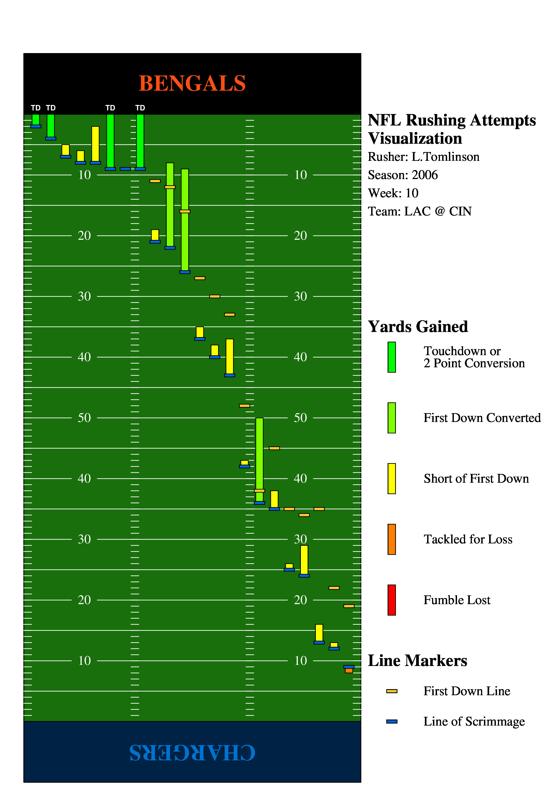

<html>
   <head>
      <meta http-equiv="Content-Type" content="text/html; charset=windows-1252">
   </head>
   <body data-new-gr-c-s-check-loaded="14.982.0">
      

      <h2><b>NFL Rushing Attempts Visualization Tool</b></h2>
      <ul>
         <li>Jonathan Ting</li>
         <li>Most recent revision: Sat May 15 2021</li>
         <li><a href="https://github.com/jonting/nrav">GitHub Repository</a></li>
      </ul>
      

      <b>The NFL Rushing Attempts Visualization Tool (NRAV)</b> is a tool for visualizing the yardage gained and success of
      each play an NFL running back makes in a game. <b>NRAV</b> runs on the command-line and parses through play-by-play
      data supplied by nflfastR-data, a repository of NFL play-by-play data on GitHub from the 1999 NFL season all the way
      to the current NFL season. It overlays the yardage gained for each rushing play of a specified NFL player onto a
      football field, sorted from closest to the goal line to furthest based on the line of scrimmage. The line of
      scrimmage and first down marker for each play are also clearly marked, along with any scoring plays and fumbles lost.
      

         Each play is represented by a vertical bar, which begins at the line of scrimmage for that play and ends where the
         rusher is downed, fumbles the ball, or enters the endzone for a score. Each play is color coded for the "success"
         of the play.
      

      <ul>
         <li>Green: Scoring play - touchdown or successful two point conversion</li>
         <li>Light Green: First down converted</li>
         <li>Yellow: Short of a first down</li>
         <li>Orange: Tackled in the backfield for a loss</li>
         <li>Red: Fumbled the ball, which is recovered by the defending team</li>
      </ul>
      

         You run <b>NRAV</b> with
      

      

         <table border="3" cellpadding="3">
            <tbody>
               <tr>
                  <td>
                     <pre>./nrav [output-file] [rusher-name] [week] [season]</pre>
                  </td>
               </tr>
            </tbody>
         </table>
      

      

         NRAV takes four input arguments:
      <ul>
         <li>The name of the output file. Do not include the file extension.
         </li>
         <li>The name of the rusher. The name is formatted as "FI.Last_Name" (FI: first initial). Must be the name of an
            NFL player who has played at least one game in the 1999 NFL season or beyond. For example, Derrick Henry is
            D.Henry.
         </li>
         <li>The week of the game being analyzed in the NFL season. Must be between 1 and 21 (inclusive) (the NFL postseason
            is Week 18-21). For example, Derrick Henry's first game of the season would be Week 1. The AFC Conference
            Championship would be Week 20. 
         </li>
         <li>The year of the NFL season. Must be between 1999 and the current NFL season year (inclusive). Keep in mind,
            the NFL postseason usually takes place in the number year after, but it is still considered part of the
            previous number year's season.
         </li>
      </ul>
      

      

      <h2>Installing NRAV</h2>
      

         <b>NRAV</b> makes calls to <b>curl</b> (downloading the raw archived .csv file from GitHub) and <b>gunzip</b>
         (decompressing the archive into a .csv file). <b>jgraph</b>, used in NRAV, also makes calls to <b>ps2pdf</b> (converting the PostScript jgraph outputs to PDF) and <b>convert</b> (converting the PDF to JPEG).
      

      

         These programs need to be installed as a prerequisite. You can install these with the following command on Debian-based systems:
      

      <pre>UNIX&gt; <b>sudo apt-get install curl gzip ghostscript imagemagick</b></pre>
      

         Additionally, <b>policy.xml</b> located in <b>/etc/ImageMagick-7</b> (7 may be any number) needs to be modified for convert to work properly. Open <b>policy.xml</b> in the text editor of your choice with root privileges and make the following change:
      

      

         <table border="3" cellpadding="3">
            <tbody>
               <tr>
                  <td valign="top"><b>Before</b> ... &lt;policy domain="coder" rights="none" pattern="PDF" /&gt; ...</td>
                  <td><b>After</b> ... &lt;policy domain="coder" rights="read | write" pattern="PDF" /&gt; ...</td>
               </tr>
            </tbody>
         </table>
      

      

         This program was tested on hydra3.eecs.utk.edu and on an Ubuntu Linux system.
      

      

      <h2>Known Issues</h2>
      

         Starting with the 2021-2022 season, the NFL has elected to move from a 16-game regular season format to an 17-game regular season format. NRAV has yet to be updated to account for that, but will be updated once the 2021-2022 season starts.
      

      

      <h2>NRAV Examples</h2>
      

        Here are some examples of NRAV outputs and what they can tell us about a particular running back's performance in a game.
      

      <pre>UNIX&gt; <b>nrav Derrick-Henry-Wk-14-2018 D.Henry 14 2018</b></pre>
      Here is the jgraph:
      

      

         <table border="3" cellpadding="3">
            <tbody>
               <tr>
                  <td></td>
               </tr>
            </tbody>
         </table>
      

      

         You can tell that Derrick Henry, the RB for the Tennessee Titans, in Week 14, 2020 against the Jaguars, was used
         quite evenly across the field in various yardage situations. He was also able to pull off touchdowns from any part
         of the field, even having a 99-yard touchdown where he was able to use his stiff arm ability and top end speed to
         break away when most others could not.
      

      
Next, take a look at Dalvin Cook in Week 1, 2020 against the Packers:

      <pre>UNIX&gt; <b>./nrav Dalvin-Cook-Wk-1-2020 D.Cook 1 2020</b></pre>
      

      

         <table border="3" cellpadding="3">
            <tbody>
               <tr>
                  <td></td>
               </tr>
            </tbody>
         </table>
      

      

         Dalvin Cook was incredibly effective in the redzone, with 4 out of 5 of his attempts inside the opponent's 5 yard
         line resulting in a score. Otherwise, he wasn't utilized as much outside the redzone, with the Vikings relying
         more on the pass game.
      

      
Next, take a look at Ezekiel Elliott in Week 6, 2020 against the Cardinals:

      <pre>UNIX&gt; <b>./nrav Ezekiel-Elliott-Wk-6-2020 E.Elliott 6 2020</b></pre>
      

      

         <table border="3" cellpadding="3">
            <tbody>
               <tr>
                  <td></td>
               </tr>
            </tbody>
         </table>
      

      

         Ezekiel Elliott, an elite running back in years past, has been struggling this season, particularly with fumbles.
         The graph shows us that he wasn't able to get any scores, with his only redzone carry resulting in lost yardage.
         Not only that, he also had a fumble, which he had been struggling with all season. What this graph doesn't show is
         that he had a second fumble from a shovel pass behind the line of scrimmage. However, because it was a pass, even
         if Elliott received it behind line of scrimmage, it isn't a run play and doesn't show up on the visualization.
      

      
Now, take a look at Rudi Johnson in Week 10, 2003 against the Texans:

      <pre>UNIX&gt; <b>./nrav Rudi-Johnson-Wk-10-2003 Ru.Johnson 10 2003</b></pre>
      

      

         <table border="3" cellpadding="3">
            <tbody>
               <tr>
                  <td></td>
               </tr>
            </tbody>
         </table>
      

      

         These inputs were chosen more to test the limits of the program. This game is notable in that it has the most
         rushing attempts by a single rusher in a game of any game in the 1999 NFL season and beyond. It is also an older game, 2003,
         which tests if older data still accurate. However, it also tells another story: the NFL was far more run-heavy in
         times past, and comparing the number of attempts in this graph to the ones above really shows how the NFL has
         become more of a passing league in the modern era.
      

      
Lastly, a Hall of Famer, LaDanian Tomlinson in Week 10, 2006 against the Bengals:

      <pre>UNIX&gt; <b>./nrav LaDainian-Tomlinson-Wk-10-2006 L.Tomlinson 10 2006</b></pre>
      

      

         <table border="3" cellpadding="3">
            <tbody>
               <tr>
                  <td></td>
               </tr>
            </tbody>
         </table>
      

      

         Have fun!
      

   </body>
</html>